# Record-1118 native protocol: recovered portion

> **Scope of this record:** I wrote the frame analysis around the earlier
> accept/flag probe. Its state diagram retains that probe's boundary. The later
> type-1 shell task and prepared video are documented separately in
> [`docs/demo-evidence.md`](../docs/demo-evidence.md).

The decoded record-1118 disassembly gives the arithmetic and control flow; the private isolated phone-home capture gives outbound frames against which to check them. Offsets below refer to the decoded binary, not virtual addresses in a loaded PE. No live endpoint was contacted, and **the original run captured no server application bytes**. I therefore treated each generated reply as a candidate until the isolated client acted on it.

## Transport and frame boundary

The client opens TCP to `45.140.205.28:443`; in the lab that address is redirected solely inside the emulator to `10.77.86.2:8443`. Captured application data is native binary, not TLS or HTTP. `recv` at `0x6df63`/`0x6e14f` reads at most 8192 bytes at a time. Callback `0xdebe8` passes bytes to `0xddb78`, which buffers at connection context `+0x130`, determines a complete frame with `0xde484`, validates it with `0x97d04`/`0x97d40`, dispatches via `0xdde18`, removes exactly the consumed bytes, and repeats. `0x978d8` rejects an invalid arithmetic header; invalid data clears the buffer and closes the connection. The first captured TCP stream has one valid 3271-byte frame plus 77380 unexplained bytes. It is not evidence of a second valid frame.

All words below are unsigned little-endian 64-bit modulo `2^64`. Let `K=0x16df3822a8`; `q[i]` is the word at header offset `8*i`.

## Header: 120 bytes

| Offset | Width | Decoding / validation | Meaning | Confidence |
| --- | ---: | --- | --- | --- |
| `0x00` | 8 | `q0` | arithmetic seed | high (static + 26 captures) |
| `0x08` | 8 | `q1=7*q0+3*K` | header check | high |
| `0x10` | 8 | low16(`q2-K+q0*q1-q5`) | version; captured `1` | high |
| `0x18` | 8 | low16(`q3-K-q0*q1-q5`) | status/flags; captured `0` | medium |
| `0x20` | 8 | `q4-K-q0*q1-q5` | Unix UTC timestamp | high |
| `0x28` | 8 | `q5=q1-37*(q0+K)` | header check | high |
| `0x30` | 8 | `q6=(q5+1)*(q0+K+1)` | header check | high |
| `0x38` | 8 | `q7` | second arithmetic seed | high |
| `0x40` | 8 | `q8-K*q7` | opaque 64-bit value; `0` outbound | high for arithmetic, low for semantics |
| `0x48` | 8 | `q9` | opaque pointer-like value outbound; no relation established | low semantics |
| `0x50` | 8 | `q10` | count/length seed | high |
| `0x58` | 8 | `q11` | count/length seed | high |
| `0x60` | 8 | `q12-K*q11-q10` | descriptor count `N`; captured `26` | high |
| `0x68` | 8 | `q13-K*q10+q11` | second count, required `<=N`; captured `26` | high arithmetic, medium role |
| `0x70` | 8 | `q14-K*(q10+q11)` | declared total frame bytes | high |

The version check at `0x97e2f..0x97e42` compares to context version `1`; count/descriptor bounds occur at `0x97eda..0x97f5c`. No cryptographic frame checksum is proven. The q1/q5/q6 relations are arithmetic validation, not a keyed MAC. A generated response using this same frame grammar caused a repeatable client timing change in the isolated probe; **the attacker's actual server framing remains unobserved**.
There is no separately established fixed magic word or header message-type opcode. Recognized receive actions are selected by decoded field tags. Neither `q8` nor `q9` has been proven to be a session ID; `q3` is a decoded status/flag value but its bit meanings are unknown. No header sequence counter, acknowledgement number, or challenge field has been identified.

## Field descriptors: 88 bytes each

At `0x78 + 0x58*i`, the 11 qwords `d0..d10` decode as follows, with `S=d0` and all arithmetic modulo `2^64`. The data region begins at `0x78+0x58*N`; field slices are concatenated in descriptor order. `0xde484` sums lengths to find the frame boundary. Decoder `0x94818` constructs the field object.

| Relative offset | Width | Decoding | Role | Confidence |
| --- | ---: | --- | --- | --- |
| `+0x00` | 8 | `S` | descriptor seed | high |
| `+0x08` | 8 | `d1-K*S-S` | sequential field ID | high |
| `+0x10` | 8 | `d2-K+3*S` | parent field ID; `0` for root | high |
| `+0x18` | 8 | `d3-K*(S+5)+2*S` | numeric field tag | high |
| `+0x20` | 8 | `d4-K-7*S` | field byte length | high |
| `+0x28` | 8 | `d5-2*K+2*S != 0` | nested/container flag | medium |
| `+0x30` | 8 | low8(`d6-K+4*S`) | opaque metadata byte; semantics unresolved | high arithmetic / low meaning |
| `+0x38` | 8 | `d7-3*K+3*S != 0` | XOR transform flag | high |
| `+0x40` | 8 | low8(`d8-K*S+4*S`) | XOR key | high |
| `+0x48` | 8 | `d9-5*K+S != 0` | optional integrity mode | medium |
| `+0x50` | 8 | low8(`d10-K+5*S`) | integrity byte/parameter | low |

When XOR is enabled, field data is XORed bytewise with the decoded key, except keys `4..39` become `3*key+7` (`0x961c4`, `0x94e28`, `0x94d94`). All captured fields use XOR and have the optional integrity flag clear. When integrity is set, at least 8 bytes are required and `0x945a4`/`0x5d264` run; the exact check is unresolved. The lab encoder refuses to generate that mode.

The byte at `+0x30` correlates with some value representations (`0x3f` occurs on stable UTF-16LE strings and `0xf9` on some 8-byte integers), but it is **not a proven type marker**: the same tags `0x55f2`, `0x55fe`, `0x5960` and `0x56b8` carry changing metadata bytes across requests. The encoder therefore uses `0` for the one-byte Boolean candidate and does not claim to implement a full type system. `0x56bd` is an opaque variable-length field, 4–252 bytes in this probe; it remains undecoded. All captured requests contain IDs `1..26`; fields 20/21 form a nested container and fields 22–25 have parent 21. A representative registration request includes UTF-16LE username `analyst`, computer name `CFX-LAB`, OS `Microsoft Windows 11 Pro`, security product, CPU/GPU, `en-US`, client version `1.6.5`, executable name `DeElevate64.exe`, and installed path.

## Receive dispatch and state

`0xdde18` first calls `0xdf29c`: field `0x56be` must decode as a 64-bit value; if it differs from context `+0x218` and a callback exists at `+0x28`, that callback runs and normal dispatch is skipped. Otherwise the following tags are considered. Their presence and validation calls are static findings; the later isolated task probe confirms only the paths described in the [demo-evidence guide](../docs/demo-evidence.md).

| Tag | Validation | Downstream state/action | Confidence |
| --- | --- | --- | --- |
| `0x56bc` | at least 1 decoded byte, true | sets ctx `+0x82=1`, resets ctx `+0x98=0`, calls `0xde8ac` and optionally `0x141450`/`0x141968` | high control flow; inferred acceptance meaning |
| `0x5951` | byte via `0x97554` | `0xd8cc8`, `0xd79ac` | medium path; unresolved meaning |
| `0x595c` | nested field; `0x595d` 64-bit child | compare with ctx `+0x218`; may emit `0x56be` and call further callbacks | medium |
| `0x5b90` | nested container; checks child tags `0x5bac`, `0x5b91`, `0x5b92`, `0x5b93`, `0x5ba3`, `0x5bab` and descendants `0x5b94..0x5b98`, `0x5ba4..0x5ba8` | tries `0xe0bc0`, `0xe0c6c`, `0xe31e4`; can enter task/config paths | high reachability; unresolved full behavior |
| `0x5953` | optional `0x5601` integer, true `0x5954`/`0x5955` | `0xd7a8c` | medium |
| `0x56b9` | true byte | connection close via `0x6c4dc` | high |
| `0x5608` | context `+0x1c8` must exist | `0x11842c` queues/forwards nested message | medium; bridge to high-level dispatch unproven |
| `0x5952` | tag present | `0x113964` | medium path; behavior unresolved |
| `0x5bd6` | tag present | `0xc60f8` | medium path; behavior unresolved |
| `0x5c4e` | tag present | `0xf6964` | medium path; behavior unresolved |

No session ID, sequence counter, acknowledgement number, challenge, or keyed check has been proven for a minimal `0x56bc` response. Context `+0x218` is a 64-bit correlation value but its initialization and expected server use remain unresolved. Header UTC timestamp is not yet proven to be validated against the guest clock. Client retry timing of about 78 seconds and 15-second receive waits are observed in the passive run; exact internal retry counters are unresolved.

`0x11842c` enqueues a forwarded nested object through `0x132e04` after local readiness checks; it does not itself call the handler table. A separate routine, `0x114f8`/`0x1150c`, calls `0x6b94` to obtain a buffer's **length** and dispatches on sizes such as `0x12c` (300), `0x190` (400), and `0x0a8c` (2700). Its `0x0a8c` branch at `0x2c824` recognizes length-like subkeys `0x0a8d..0x0a93`. These keys are recorded in `opcode-handler-map.tsv` as size-dispatch keys; they are **not established wire opcodes**. A direct path from an inbound `0x5608` field to this size dispatcher remains unproven, so none of those branches is exposed by the lab server.

## State machine

This diagram records the earlier receive-side reconstruction. The later type-1 task probe is documented separately.

```mermaid
stateDiagram-v2
    [*] --> TCPConnected: outbound connect
    TCPConnected --> RequestSent: profile frame sent (observed)
    RequestSent --> Waiting: recv callback armed
    Waiting --> Retry: EOF / timeout / invalid frame (observed passive run)
    Retry --> TCPConnected: later retry (observed)
    Waiting --> Parsed: complete valid frame (static path)
    Parsed --> AcceptedCandidate: true 0x56bc (static path, runtime unproven)
    Parsed --> Close: true 0x56b9 (static path)
    Parsed --> TaskContainer: 0x5b90 or 0x5608 (static path; no lab tasking)
    AcceptedCandidate --> Waiting: next action unresolved
```

## Lab implementation and proof boundary

`protocol.py` implements the shared arithmetic parser, descriptor decoder, conservative encoder, and bounded stream framing. `server.py` binds only `10.77.86.2:8443`, accepts peers only within `10.77.86.0/24`, saves raw frames, logs decoded metadata, and has no upstream/network-forwarding function. Default mode is receive-only; `--response accept` sends exactly one generated frame containing `0x56bc=01` after the first parsed client frame. It cannot generate tasking tags. `replay_capture.py` validates the captured frames and round-trips the candidate locally. A socket staying open would be insufficient proof; client-side state change or a subsequent request after the response is required.

Current proof: **offline reconstruction passes, and the isolated client distinguishes the generated true and false `0x56bc` fields.** Across 6 initial true and 5 confirming true responses, the client left the socket open until the server's 30-second idle timeout (median 30.7745 and 30.78 seconds after request) and reconnected at median 33.889 and 33.892 seconds. In 3 receive-only and 3 false-response controls, the client itself closed after about 15 seconds (median 14.901 and 14.91 seconds) and reconnected at median 77.898 and 77.903 seconds. Every generated 209-byte response appears byte-for-byte in the VirtualBox NIC PCAP; all 18 guest-logged requests also match the PCAP. This establishes a **benign receive/retry-state transition**, consistent with the static `ctx+0x82` assignment. It does not establish a complete registration/session exchange, a later task, or a durable new session ID. No ACK/keepalive/retry-reset messages are implemented because their exact tags and semantics have not been proven. This is a deliberately narrow controller, not a claim of complete attacker protocol reconstruction.
